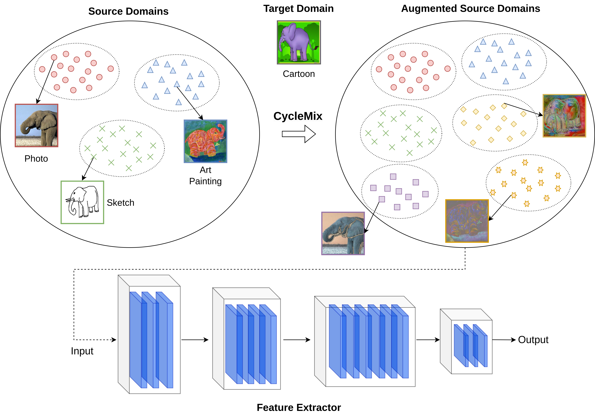

# Welcome to CycleMix
This is the official code for the "CycleMix: Mixing Source Domains for Domain 
Generalization in Style-Dependent Data" paper, to be published in the proceedings of 
the 13th Hellenic Conference on Artificial Intelligence (SETN 2024).
The preprint is available [here](https://arxiv.org/abs/2308.14418).

## Method
In this work, we tackle the Domain Generalization (DG) 
problem by training a robust feature extractor which disregards features attributed 
to image-style but infers based on style-invariant image representations. To achieve this, 
we train CycleGAN models to learn the different styles present in the training data and 
randomly mix them together to create samples with novel style attributes to improve 
generalization.



## Quick start

Download the datasets:

```sh
python3 -m domainbed.scripts.download \
       --data_dir=./domainbed/data
```

Train a model:

```sh
python3 -m domainbed.scripts.train\
       --data_dir=./domainbed/data/MNIST/\
       --algorithm CYCLEMIX\
       --dataset PACS\
       --test_env 2
```

Launch a sweep:

```sh
python -m domainbed.scripts.sweep launch\
       --data_dir=/my/datasets/path\
       --output_dir=/my/sweep/output/path\
       --command_launcher local\
       --algorithms CYCLEMIX\
       --datasets PACS\
       --n_hparams 2\
       --n_trials 1
```

To view the results of your sweep:

````sh
python -m domainbed.scripts.collect_results\
       --input_dir=/my/sweep/output/path
````

## License

This source code is released under the MIT license, included [here](LICENSE).


## Cite Us
If you use the above code for your research please cite our paper:
```citation

```